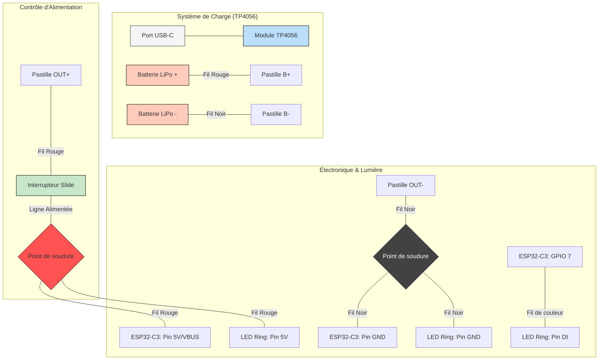

# StarFox-Reflector-DIY-ESP32-C3-version

Ce projet permet de fabriquer une réplique lumineuse du **Réflecteur de Fox McCloud** (Star Fox / Super Smash Bros). Il utilise un microcontrôleur ESP32-C3 SuperMini pour piloter un anneau de LEDs NeoPixel, le tout alimenté par une batterie rechargeable.

## 🚀 Caractéristiques

* **Effet Lumineux :** Bleu Cyan avec scintillement "énergie".
* **Autonomie :** ~5 heures (avec batterie 1000mAh).
* **Mode Éco :** WiFi et Bluetooth désactivés matériellement via le code.
* **Rechargeable :** Port USB-C intégré pour la recharge.

## 📦 Liste des Composants

| Composant | Description |
| --- | --- |
| **Microcontrôleur** | ESP32-C3 SuperMini |
| **LEDs** | Anneau 12 LEDs RGB WS2812B (NeoPixel) |
| **Batterie** | LiPo 3.7V 1000mAh (Type 803040) |
| **Chargeur** | Module TP4056 avec protection (USB-C) |
| **Bouton** | Interrupteur à glissière (Slide Switch) |
| **Structure** | Boîtier hexagonal (Impression 3D ou Plexiglas) |


## ⚡ Schéma de Branchement



## 💻 Code Source (Arduino IDE)

**Pré-requis :** 1. Installer la bibliothèque **Adafruit NeoPixel** via le gestionnaire de bibliothèques.

2. Sélectionner la carte **ESP32C3 Dev Module** dans les réglages.

```cpp
#include <Adafruit_NeoPixel.h>
#include <WiFi.h>
#include <esp_bt.h>
#include <esp_wifi.h>

#define PIN_LED 7       // GPIO 7 sur ESP32-C3
#define NUM_LEDS 12    

Adafruit_NeoPixel strip(NUM_LEDS, PIN_LED, NEO_GRB + NEO_KHZ800);

void setup() {
  // Désactivation des ondes pour économiser la batterie
  WiFi.mode(WIFI_OFF);
  btStop();
  esp_wifi_stop();

  strip.begin();
  strip.setBrightness(120); // Ajuster selon l'épaisseur du diffuseur
  strip.show();
}

void loop() {
  // Fond Bleu Cyan
  for(int i=0; i<NUM_LEDS; i++) {
    strip.setPixelColor(i, strip.Color(0, 160, 255)); 
  }
  strip.show();
  delay(50);
  
  // Effet de scintillement
  int spark = random(NUM_LEDS);
  strip.setPixelColor(spark, strip.Color(255, 255, 255));
  strip.show();
  delay(20);
}

```

## 🛠️ Instructions de Montage

1. **Préparation :** Souder les fils sur le module **TP4056** (B+/B- vers batterie, OUT+/OUT- vers le reste).
2. **Interruption :** Placer l'interrupteur sur le fil positif (`OUT+`) pour couper toute consommation.
3. **Signal :** Relier la pin **GPIO 7** à l'entrée **DI** de l'anneau LED.
4. **Diffusion :** Placer un disque de plastique givré ou de papier calque entre les LEDs et la vitre du réflecteur pour un rendu lisse.

## ⚠️ Sécurité

* Ne jamais charger la batterie sans surveillance.
* Isoler toutes les soudures avec de la gaine thermorétractable ou du ruban d'électricien.
* S'assurer que la batterie ne subit pas de pression ou de choc dans le boîtier.